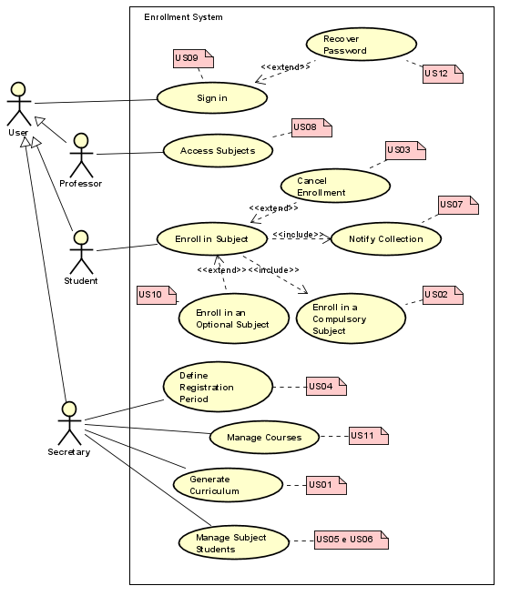

# School Enrollment System
This repository contains the Enrollment System project developed for the Software Development Laboratory course, part of the Software Engineering program at PUC Minas.

## Group Members
* [Gabriel Ramos](https://github.com/gramos22)

* [João Pedro Braga](https://github.com/joaopedro-braga)

* [Júlia Moreira Nascimento](https://github.com/JulyaMoreyra)

## Project Description
The Enrollment System is a software developed to automatize the course enrollment process at a university.

The system allows students to enroll in mandatory and elective subjects and enables the cancellation of enrollments.

The system also generates notifications for the university's billing system and provides professors with a view of which students are enrolled in their courses.

### Functionalities
* **Course Registration:** Allows the university's administration to register subjects, associating professors and students.
* **Course Enrollment:** Students can enroll in up to 4 mandatory courses and 2 elective courses.
* **Enrollment Cancellation:** Students can cancel their enrollments within the established period.
* **Enrolment Control:** Each course has a spot limit and is activated only if there is a minimum number of enrolled students.
* **Payment Notifications:** Integration with the billing system to generate payment slips based on the enrollments made.
* **Enrollment Overview:** Professors can view the list of students enrolled in their courses.

### Technologies Utilized
* **Programming Language:** Java
* **Modeling Tools:** Astah, draw.io
* **Version Control:** Git/GitHub

## User Stories

### US01
```
As a secretary,
I want to be able to generate a curriculum for each semester
so that I can maintain information about courses, professors, and students.
```

### US02
```
As a student,
I want to be able to enroll in mandatory courses
so that I can organize my study schedule.
```

### US03
```
As a student,
I want to be able to cancel my enrollment,
so that I can withdraw from a course when necessary.
```

### US04
```
As a secretary,
I want to be able to set the period during which students can access the system
to define their enrollment time.
```

### US05
```
As a secretary,
I want a course to be automatically canceled if it has fewer than three students enrolled
so that I don't have to allocate teachers to small classes.
```

### US06
```
As a secretary,
I want the registration for a course to be closed if it has 60 students enrolled
so that the classrooms don't get overcrowded.
```

### US07
```
As a secretary,
I want the billing system to notify the student after enrollment
so that they know how to pay for the courses they have registered for.
```

### US08
```
As a professor,
I want to be able to access the system
to see which students are enrolled in each course.
```

### US09
```
As a user,
I want my account to be protected by a password
so that no one else can access it.
```

### US10
```
As a student,
I want to be able to enroll in elective courses,
so that I can create my personalized study schedule.
```

### US11
```
As a secretary, 
I want to be able to register and modify courses, 
so that I can determine the number of credits and the subjects that compose them.
```

### US12
```
As a user, 
I want to be able to recover my password, 
so that I can access my account.
```

## Use Case Diagram



## Class Diagram


[Acessar Figma](https://www.figma.com/board/Th7yAG7cy99eHgFXyXoaOa/Class-Diagram---Enrollment-System?node-id=0-1&t=nfERT34drKPhAzjv-0)

## How to Run the Project

### Prerequisites

Make sure you have the following tools installed on your machine:
- **Java Development Kit (JDK)** - Version 11 or higher
- **Node.js** - Version 14 or higher
- **Maven** - For managing Spring Boot dependencies
- **Git** - For cloning the repository

### Clone the Repository

To get started, clone this repository to your local machine:

```bash
git clone https://github.com/your-username/your-repository.git
````

### Running the Backend (Spring Boot)
1. Navigate to the `backend` directory:
   
    ```
    cd LDS-Sistema-De-Matriculas/sources/backend
    ```
3. Install the project dependencies using Maven:
    ```
    mvn clean install
    ``` 
4. Run the Spring Boot application:
    ```
    mvn spring-boot:run
    ```
### Running the Frontend (React)

1. Navigate to the `frontend` directory:
   
   ```
   cd LDS-Sistema-De-Matriculas/sources/frontend/enrollment-system
   ```
3. Install the project dependencies using npm:
   ```
   npm install
   ```
4. Start the React application:
   ```
    npm start
   ```
The frontend should now be running at `http://localhost:3000`.

### Accessing the Application
Once both the backend and frontend are running, you can access the application by visiting:
```
http://localhost:3000
```

