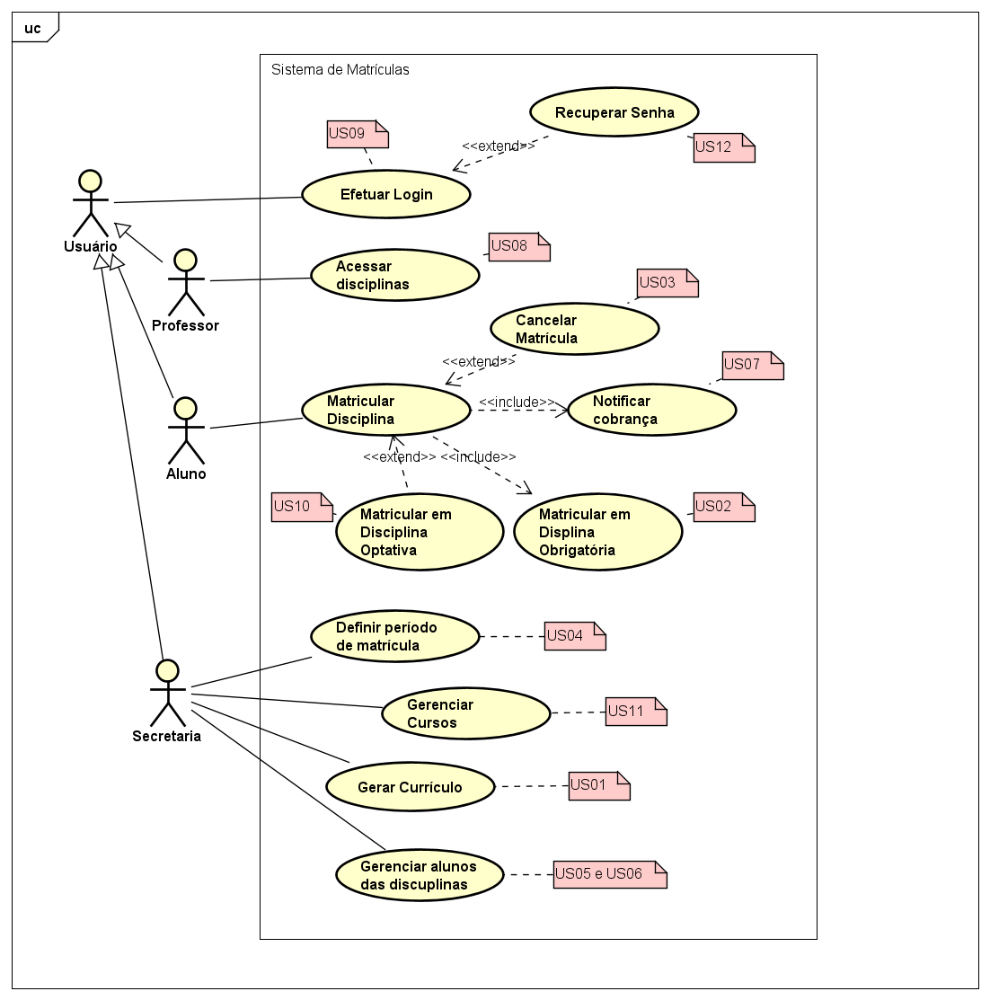

# Laboratório 01 - Sistema de Matrículas

> User Stories

### US01
```
Como secretaria, 
eu desejo poder gerar um currículo para cada semestre
para manter as informações sobre as disciplinas, professores e alunos.
```

### US02
```
Como aluno,
eu desejo poder me matricular em disciplinas obrigatórias
para que eu possa montar minha grade de estudos
```

### US03
```
Como aluno,
eu desejo poder cancelar minha matrícula,
para que eu possa desistir de um curso quando necessário 
```

### US04
```
Como secretaria,
eu desejo poder definir o período em que os alunos podem acessar o sistema
para definir seu tempo de matricula
```

### US05
```
Como secretaria,
eu desejo que uma disciplina seja cancelada automáticamente caso tenha menos de três alunos matriculados
para não precisar alocar professores em turmas muito pequenas
```

### US06
```
Como secretaria,
eu desejo que as incrições para uma disciplina sejam encerradas caso a mesma tenha 60 alunos matriculados
para não ter salas muito cheias
```

### US07
```
Como secretaria,
eu desejo que o sistema de cobranças notifique o aluno após sua matrícula
para que o mesmo saiba como pagar pelas disciplinas em que se inscreveu
```

### US08
```
Como professor,
eu desejo poder acessar o sistema
para ver quaias alunos estão cadastrados em cada disciplina
```

### US09
```
Como usuário,
eu desejo que minha conta seja protegida por uma senha
para que ninguém possa acessá-la
```

### US10
```
Como aluno, 
eu desejo poder me cadastrar em disciplinas optativas, 
para que eu possa montar minha grade de estudos personalizada
```

### US11
```
Como secretaria, 
eu desejo poder cadastrar e modificar os cursos, 
para poder determinar o número de créditos e as disciplinas que o compõe 
```

### US12
```
Como usuário, 
eu desejo poder recuperar minha senha, 
para poder acessar minha conta
```

> UseCase Diagram


